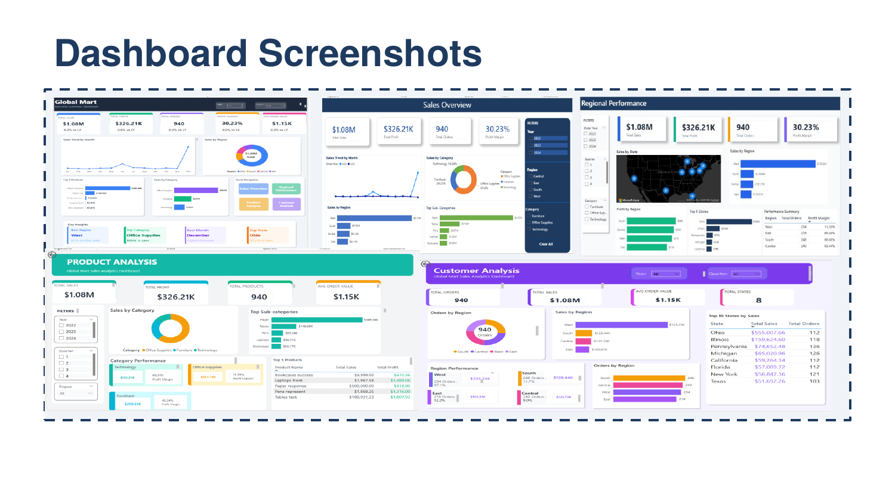

# Global Mart Sales Performance Analysis


A comprehensive sales performance analysis for Global Mart, a multinational retail company, using Power BI and the CRISP-DM methodology. This project identifies key business insights and provides actionable recommendations to improve profitability.



## 📋 Table of Contents

- [Business Problem](#business-problem)
- [Dataset](#dataset)
- [Methodology](#methodology)
- [Data Preparation](#data-preparation)
- [Data Model](#data-model)
- [Dashboards](#dashboards)
- [Key Findings](#key-findings)
- [Recommendations](#recommendations)
- [Tools Used](#tools-used)
- [Project Structure](#project-structure)
- [How to Use](#how-to-use)
- [Author](#author)

## 🎯 Business Problem

Global Mart, a multinational retail company specializing in Furniture, Office Supplies, and Technology, needed to optimize its sales performance and profitability. The company lacked clear visibility into:

- Which regions are underperforming
- Which products drive the most profit
- Seasonal trends affecting sales

**Project Goal:** Explore, analyze, and visualize sales data to identify growth opportunities, uncover trends, and address challenges in sales performance.

## 📊 Dataset

| Attribute | Details |
|-----------|---------|
| **Total Records** | 1,010 rows |
| **Time Period** | December 2022 - December 2024 |
| **Regions** | 4 (East, West, Central, South) |
| **States** | 8 US states |
| **Categories** | 3 (Furniture, Office Supplies, Technology) |

**Data Fields:** Row ID, Order ID, Order Date, Region, State, Category, Sub-Category, Product Name, Sales, Quantity, Discount, Profit

## 🔬 Methodology

This project follows the **CRISP-DM (Cross-Industry Standard Process for Data Mining)** framework:

1. **Business Understanding** - Defined objectives and key questions
2. **Data Understanding** - Explored dataset structure and quality
3. **Data Preparation** - Cleaned and transformed data
4. **Modeling** - Built data model and DAX measures
5. **Evaluation** - Analyzed findings and validated insights
6. **Deployment** - Created interactive dashboards

## 🧹 Data Preparation

### Data Quality Issues Identified
- Missing Order Dates: 61 rows (6%)
- Missing Regions: 60 rows (6%)
- Missing Sales: 60 rows (6%)
- Duplicate Rows: 10 rows
- Invalid Quantity: 4 rows (text values)
- Negative Discounts: 5 rows
- Inconsistent naming (case issues)

### Cleaning Steps (Power Query)
1. Standardized Region names (Trim + Capitalize Each Word)
2. Removed 10 duplicate rows
3. Filtered out null values (~51 rows)
4. Removed invalid Quantity entries (4 rows)
5. Removed negative Discounts (5 rows)

### Transformations
- Created new columns: Order Year, Order Month, Quarter
- Formatted data types: Sales/Profit → Currency, Discount → Percentage

**Result:** 940 clean records (93% data retention)

## 🗂️ Data Model

Built a **star schema** with the following structure:

```
                    ┌─────────────┐
                    │  DateTable  │
                    └──────┬──────┘
                           │
┌─────────────┐    ┌──────┴──────┐    ┌─────────────┐
│ ProductDim  │────│   Fact:     │────│  RegionDim  │
│             │    │ Sales_Data  │    │             │
└─────────────┘    └─────────────┘    └─────────────┘
```

### DAX Measures Created (15+)

| Measure | Purpose |
|---------|---------|
| Total Sales | Sum of all sales revenue |
| Total Profit | Sum of profit |
| Total Orders | Count of orders |
| Profit Margin | Profit / Sales |
| Sales YOY % | Year-over-year growth |
| Sales YTD | Year-to-date sales |
| Profit YTD | Year-to-date profit |
| Avg Order Value | Sales / Orders |
| Sales MTD | Month-to-date sales |
| Total Quantity | Sum of quantity sold |
| Average Discount | Mean discount applied |

## 📈 Dashboards

Five interactive dashboards were developed:

### 1. Executive Summary
High-level KPIs including Total Sales ($1.08M), Total Profit ($326K), Profit Margin (30.23%), and Total Orders (940). Serves as the main navigation hub.

### 2. Sales Overview
Detailed sales analysis with Year/Region/Category slicers. Displays sales trends over time and category breakdown.

### 3. Regional Performance
Geographic analysis with map visualization showing sales by state. Includes performance comparison table by region.

### 4. Product Analysis
Category profitability breakdown for Furniture, Office Supplies, and Technology. Identifies top-performing products and sub-categories.

### 5. Customer Analysis
Order distribution by region and top-performing states analysis.

**Interactive Features:** Navigation buttons, Slicers, Clear All functionality, Cross-filtering, Tooltips

## 🔍 Key Findings

### Finding 1: Regional Performance Gap

| Region | Sales | Share | Profit | Margin |
|--------|-------|-------|--------|--------|
| West | $723K | 67% | $81K | 11.2% |
| East | $142K | 13% | $97K | 68.5% |
| Central | $128K | 12% | $83K | 64.8% |
| South | $85K | 8% | $65K | 76.5% |

**Critical Insight:** West generates 67% of sales but only 11.2% profit margin. East makes MORE profit ($97K) on LESS sales ($142K).

### Finding 2: Product Profitability

| Category | Sales | Share | Profit | Margin |
|----------|-------|-------|--------|--------|
| Office Supplies | $664K | 61.6% | $115K | 17.4% |
| Furniture | $259K | 24.0% | $104K | 40.3% |
| Technology | $155K | 14.4% | $106K | 68.3% |

**Critical Insight:** Technology has the highest margin (68.3%) but lowest sales share (14.4%) - significantly under-leveraged.

### Finding 3: Geographic & Seasonal Patterns

- **Top State:** Ohio dominates with 51.4% of total sales ($555K)
- **Seasonal Peak:** December shows highest sales across all years
- **Top 5 States:** Ohio, Illinois, Pennsylvania, Michigan, California

## 💡 Recommendations

| # | Recommendation | Current | Target | Potential Impact |
|---|----------------|---------|--------|------------------|
| 1 | Fix West Region Margins | 11.2% | 40%+ | +$150-200K/year |
| 2 | Grow Technology Sales | 14% share | 25% share | +$80-100K/year |
| 3 | Leverage Seasonality | - | Q4 prep by Nov | +15-20% Q4 sales |
| 4 | Replicate Ohio Success | - | Other states | Improve underperformers |

**Estimated Total Impact:** +$250-350K annual profit improvement

## 🛠️ Tools Used

- **Power BI Desktop** - Data modeling, DAX measures, dashboard development
- **Power Query** - Data cleaning and transformation
- **Microsoft Excel** - Source data
- **CRISP-DM** - Project methodology framework

## 📁 Project Structure

```
globalmart-sales-analysis/
├── README.md
├── Global_Mart.pbix              # Power BI report file
├── data/
│   └── GlobalMart_Sales_Data.xlsx    # Source dataset
├── documentation/
│   └── GlobalMart_Report.pdf         # Detailed project report
└── images/
    └── dashboard-preview.png         # Dashboard screenshots
```

## 🚀 How to Use

1. **Clone the repository**
   ```bash
   git clone https://github.com/yourusername/globalmart-sales-analysis.git
   ```

2. **Open the Power BI file**
   - Download and install [Power BI Desktop](https://powerbi.microsoft.com/desktop/)
   - Open `Global_Mart.pbix`

3. **Explore the dashboards**
   - Use the navigation buttons to switch between dashboards
   - Apply filters using slicers (Year, Region, Category)
   - Hover over visuals for detailed tooltips

## 👤 Author

**Annrisper**

- GitHub: [@annrisper](https://github.com/annrisper)
  
